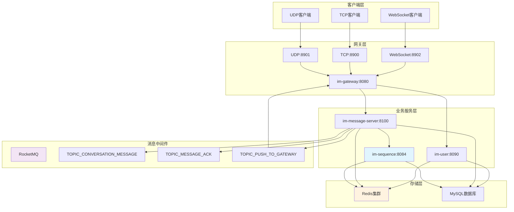

# IM Plus - 企业级即时通讯系统
> 🚀 基于Spring Boot + Netty + Redis + RocketMQ的高性能分布式即时通讯解决方案
[](https://www.oracle.com/java/)
[](https://spring.io/projects/spring-boot)
[](https://netty.io/)
[](https://redis.io/)
[](https://rocketmq.apache.org/)
[](LICENSE)
IM Plus是一个现代化的即时通讯系统，采用微服务架构设计，支持私聊、群聊等核心功能。系统具备高并发、高可用、易扩展的特点，适用于企业内部通讯、社交应用、客服系统等多种场景。
**🎯 项目状态：** 核心功能已实现，架构设计优秀，适合学习和二次开发
## ⭐ 核心亮点
### 🎯 架构创新
- 🚀 **推拉结合传输模式**: 推送保证实时性，拉取保证最终一致性，序列号驱动同步
- 🏗️ **统一消息表设计**: 私聊和群聊消息统一存储，简化架构，便于维护扩展
- ⚡ **混合扩散策略**: 私聊写扩散(高读性能) + 群聊读扩散(高写性能)，最优资源利用
- 🔄 **双重确认机制**: 发送回执 + 接收ACK，状态驱动的消息生命周期管理
- 🎯 **会话级串行化处理**: 网关层会话工作队列模型，保证同一会话消息严格顺序性
- 🔀 **消息分离架构**: ACK消息与业务消息分离处理，统一分发器模式，避免竞争条件
### 🎲 自研序列号服务
- **高性能架构**: 基于Redis+Lua脚本的分段预分配策略，万级QPS序列号生成
- **原子操作保证**: Lua脚本确保序列号生成的原子性，避免竞态条件
- **分段并发设计**: 1024个分段，支持无锁高并发访问
- **异步持久化**: 独立线程池异步持久化，不阻塞主请求响应
- **多层降级策略**: 服务不可用时自动切换到备用方案，保证系统可用性
- **企业级监控**: 完整的健康检查、统计信息和性能监控体系
### 🛠️ 核心功能
- ✅ **私聊消息**: 一对一实时消息收发，支持写扩散模式，包含权限校验和黑名单机制
- ✅ **群聊消息**: 群组聊天，支持读扩散模式，适合大群场景，轻量级通知推送
- ✅ **多协议支持**: WebSocket、TCP、UDP三种连接方式，满足不同场景需求
- ✅ **心跳保活**: 自动心跳检测，维持连接稳定性，及时清理无效连接
- ✅ **消息存储**: 统一消息表设计，支持私聊和群聊消息统一管理
- ✅ **离线消息**: 完整的离线消息拉取和会话同步机制，支持断点续传
- ✅ **消息确认**: 完整的ACK确认机制，确保消息可靠投递
- ✅ **超时重发**: 基于时间轮算法的消息超时重发机制，指数退避策略
- ✅ **会话管理**: 会话列表同步，未读数管理，最新消息预览
- ✅ **分布式架构**: 微服务架构，支持水平扩展，无状态设计
- ✅ **高性能序列号**: 独立序列号生成服务，Redis+Lua脚本原子操作，分段预分配策略
- ⚠️ **用户管理**: 基础架构已实现，服务间调用待完善（存在技术债务）
### 🔥 技术特性
- ⚡ **高性能**: 基于Netty NIO，支持万级并发连接，消息推送延迟 < 100ms
- 🛡️ **高可用**: Redis + RocketMQ消息队列保证服务可用性，设计目标99.9% SLA
- 🔒 **消息可靠**: 序列号机制 + 双重确认 + 超时重发 + 幂等性保证，确保消息不丢失不重复
- 📋 **顺序保证**: RocketMQ顺序消费 + 会话级串行化，确保消息严格按发送顺序处理
- 🔀 **架构分离**: ACK消息与业务消息分离处理，统一分发器模式，避免竞争条件
- 🚀 **缓存优化**: Redis缓存热点数据，智能过期策略，提升响应速度
- ⚖️ **负载均衡**: 网关层负载均衡，支持多实例部署，自动故障转移
- 🎯 **智能路由**: 基于RocketMQ的分布式消息路由，支持跨网关推送
## 🏗️ 系统架构
### 🎨 整体架构图

### 📦 模块结构
- **im-gateway**: 网关服务，负责客户端连接管理、消息路由转发、负载均衡、协议适配、会话级串行化处理
- **im-user**: 用户服务，提供用户注册、登录、认证、好友关系管理、在线状态管理
- **im-message-server**: 消息服务，负责消息存储、推送分发、离线消息处理、会话管理
- **im-sequence**: 序列号服务，基于Redis+Lua脚本的高性能序列号生成器，支持分段预分配和异步持久化
- **im-common**: 通用模块，包含协议定义、工具类、常量、共享模型、Redis配置等
- **im-client**: 客户端实现，支持WebSocket、TCP、UDP三种连接协议，Redis存储模拟
### 🛠️ 技术栈
#### 核心框架
- **后端框架**: Spring Boot 3.4.3 - 企业级微服务框架
- **通信框架**: Netty 4.1.119.Final - 高性能异步网络通信
- **开发语言**: Java 17 - 现代化Java开发
#### 中间件
- **消息队列**: RocketMQ 4.9.6 - 分布式消息中间件，支持事务消息和顺序消费
  - TOPIC_CONVERSATION_MESSAGE: 业务消息Topic，支持顺序消费
  - TOPIC_MESSAGE_ACK: ACK消息Topic，支持并发处理
  - TOPIC_PUSH_TO_GATEWAY: 网关推送Topic，支持跨网关消息路由
- **缓存系统**: Redis + Redisson 3.44.0 - 分布式缓存，支持集群模式
  - 序列号分段缓存: Redis Hash存储分段状态，Lua脚本原子操作
  - 消息缓存: 离线消息、会话列表、用户状态缓存
- **数据库**: MySQL 8.0 + MyBatis Plus 3.5.10.1 - 关系型数据库持久化
- **序列号生成**: 自研高性能序列号服务 - Redis+Lua脚本，分段预分配，万级QPS
#### 通信协议
- **序列化**: Protobuf 3.25.2 - 高效二进制序列化
- **连接协议**: WebSocket、TCP、UDP - 多协议支持
- **消息协议**: 自定义ChatMessage协议 - 支持扩展字段
#### 架构模式
- **消息传输**: 推拉结合模式 - 实时性 + 最终一致性
- **存储模式**: 私聊写扩散 + 群聊读扩散 - 性能最优化
- **可靠性**: 双重确认 + 时间轮超时重发 + 幂等性保证
- **会话管理**: 统一消息表 + 会话列表同步 + Redis缓存
- **序列号生成**: 分段预分配 + Redis原子操作 + 异步持久化 - 高性能无锁设计
## 📡 消息协议 (ChatMessage.proto)
### 协议概述
IM Plus采用基于Protobuf 3.25.2的自定义ChatMessage协议，支持私聊、群聊、系统消息等多种消息类型。协议设计充分考虑了推拉结合消息传输模式的需求，通过扩展字段支持序列号驱动的消息同步机制。
### Proto文件定义
```protobuf
syntax = "proto3";
package com.vanky.im.common.protocol;
// 定义Java代码生成相关的选项
option java_package = "com.vanky.im.common.protocol";
option java_multiple_files = true;
message ChatMessage {
  int32 type = 1;           // 协议类型
  string content = 2;       // 消息内容
  string fromId = 3;        // 发送方id
  string toId = 4;          // 接收方id
  string uid = 5;           // 全局唯一ID
  string seq = 6;           // 客户端生成的消息ID
  int64 timestamp = 7;      // 时间戳
  int32 retry = 8;          // 重试次数
  string token = 9;         // 身份验证token，用于连接验证
  string conversationId = 10; // 会话ID，用于标识具体的会话
  string clientSeq = 11;      // 客户端生成的临时序列号，用于回执匹配
  // 推拉结合模式新增字段
  int64 userSeq = 12;         // 用户级全局序列号（私聊消息使用）
  int64 conversationSeq = 13; // 会话级序列号（群聊消息使用）
  int64 expectedSeq = 14;     // 客户端期望的下一个序列号（用于空洞检测）
  
  // 消息回执相关字段
  ReadReceipt readReceipt = 15;     // 已读回执信息
  ReadNotification readNotification = 16; // 已读通知信息
}
```
### 字段详细说明
#### 🔹 基础消息字段
| 字段 | 类型 | 说明 | 使用场景 |
|------|------|------|----------|
| `type` | int32 | 协议类型，标识消息的具体类型 | 所有消息类型，如3001(私聊)、3002(群聊)、1007(群聊通知) |
| `content` | string | 消息内容，支持文本、JSON等格式 | 聊天消息、系统通知、多媒体消息URL |
| `fromId` | string | 发送方用户ID | 标识消息发送者，用于权限验证和显示 |
| `toId` | string | 接收方ID，可以是用户ID或群组ID | 私聊时为用户ID，群聊时为群组ID |
| `uid` | string | 全局唯一消息ID，由雪花算法生成 | 消息去重、状态追踪、数据库主键 |
| `seq` | string | 客户端生成的消息序列号 | 客户端消息排序、重发队列管理 |
| `timestamp` | int64 | 消息时间戳（毫秒） | 消息排序、过期检查、显示时间 |
| `retry` | int32 | 重试次数计数器 | 超时重发机制、失败统计 |
#### 🔹 身份认证字段
| 字段 | 类型 | 说明 | 使用场景 |
|------|------|------|----------|
| `token` | string | JWT身份验证令牌 | 连接建立时的身份验证，防止非法连接 |
#### 🔹 会话管理字段
| 字段 | 类型 | 说明 | 使用场景 |
|------|------|------|----------|
| `conversationId` | string | 会话唯一标识 | 私聊格式：`private_小ID_大ID`<br>群聊格式：`group_群组ID` |
#### 🔹 消息回执字段
| 字段 | 类型 | 说明 | 使用场景 |
|------|------|------|----------|
| `clientSeq` | string | 客户端临时序列号，UUID格式 | 消息发送回执匹配、幂等性保证、重发队列管理 |
| `readReceipt` | ReadReceipt | 已读回执信息 | 消息已读状态管理、已读回执通知 |
| `readNotification` | ReadNotification | 已读通知信息 | 已读状态变更通知、消息状态同步 |
#### 🔹 推拉结合模式字段（核心创新）
| 字段 | 类型 | 说明 | 使用场景 |
|------|------|------|----------|
| `userSeq` | int64 | 用户级全局序列号 | **私聊消息**：标识用户接收到的消息顺序<br>空洞检测、离线消息拉取、消息去重 |
| `conversationSeq` | int64 | 会话级序列号 | **群聊消息**：标识会话内消息顺序<br>群聊消息同步、会话状态管理 |
| `expectedSeq` | int64 | 客户端期望的下一个序列号 | 消息空洞检测、拉取补偿触发条件 |
### 使用场景说明
#### 私聊消息流程
1. **发送阶段**：客户端设置`type=3001`、`fromId`、`toId`、`content`、`clientSeq`、`conversationId`
2. **服务端处理**：生成`uid`、`userSeq`，分配消息序列号
3. **推送阶段**：服务端推送时携带`userSeq`，客户端检查序列号连续性
4. **确认阶段**：客户端发送ACK，服务端更新消息状态
#### 群聊消息流程
1. **发送阶段**：客户端设置`type=3002`、`fromId`、`toId`(群组ID)、`content`、`conversationId`
2. **服务端处理**：生成`conversationSeq`，创建轻量级通知
3. **通知推送**：推送`type=1007`通知，携带`conversationSeq`
4. **主动拉取**：客户端基于`conversationSeq`主动拉取完整消息内容
#### 推拉结合同步
1. **实时推送**：在线用户接收推送消息，检查`userSeq`/`conversationSeq`连续性
2. **空洞检测**：发现序列号空洞时，使用`expectedSeq`触发拉取补偿
3. **离线拉取**：用户上线后，基于本地序列号与服务端对比，拉取缺失消息
4. **顺序保证**：通过乱序缓冲区确保消息按序处理和显示
### 与系统架构的集成
#### 消息队列集成
- **RocketMQ Key**：使用`conversationId`作为消息Key，确保同一会话消息的顺序投递
- **消息分离**：业务消息和ACK消息使用不同Topic，避免竞争条件
#### 数据库存储
- **统一消息表**：`uid`作为主键，`conversationId`用于会话关联
- **序列号索引**：`userSeq`和`conversationSeq`用于高效的范围查询
#### Redis缓存
- **消息缓存**：以`uid`为Key缓存消息内容，TTL 1天
- **序列号管理**：分别缓存用户级和会话级序列号，支持高并发生成
#### 网关路由
- **会话级串行化**：基于`conversationId`进行哈希分配，确保同一会话消息串行处理
- **多协议支持**：WebSocket、TCP、UDP三种协议统一使用ChatMessage格式
## 🌐 服务端口配置
### 🚀 应用服务端口
| 服务 | 端口 | 协议 | 说明 |
|------|------|------|------|
| **im-gateway** | 8080 | HTTP | 网关服务主端口 |
| | 8900 | TCP | TCP长连接端口 |
| | 8901 | UDP | UDP连接端口 |
| | 8902 | WebSocket | WebSocket连接端口 |
| **im-user** | 8090 | HTTP | 用户服务API端口 |
| **im-message-server** | 8100 | HTTP | 消息服务API端口 |
| **im-sequence** | 8084 | HTTP | 序列号服务API端口 |
## 📋 已实现功能
### 1. 用户管理系统
- **用户注册**: 支持用户ID唯一性校验，密码加密存储
- **用户登录**: JWT Token认证，支持多端登录
- **用户退出**: 清理会话信息，释放资源
- **在线状态**: Redis存储用户在线状态，实时更新
- **好友关系**: 好友关系校验，黑名单机制
- **用户状态**: 用户封禁、禁言状态检查
**API接口**:
```
POST /users/register  - 用户注册
POST /users/login     - 用户登录
GET  /users/logout/{userId} - 用户退出
```
### 2. 连接管理系统
- **多协议支持**: WebSocket、TCP、UDP三种连接方式
- **连接认证**: Token验证，防止非法连接
- **会话管理**: Redis存储用户会话信息，支持分布式部署
- **心跳保活**: 自动心跳检测，及时清理无效连接
### 3. 私聊消息系统 (写扩散模式)
- **消息发送**: 实时消息推送，支持文本、图片等多种类型
- **消息存储**: 为每个用户单独存储消息副本，读取性能优异
- **消息确认**: ACK确认机制，确保消息可靠投递
- **超时重发**: 基于时间轮算法的消息超时重发机制
- **历史消息**: 支持历史消息查询和分页
- **权限校验**: 用户状态、好友关系、黑名单检查
- **会话管理**: 维护会话列表，更新未读数和最新消息
**数据库设计**:
- `message`: 统一存储私聊和群聊消息内容
- `user_msg_list`: 用户消息索引表，支持快速查询
- `user_conversation_list`: 用户会话列表，包含未读数和最新消息ID
### 4. 群聊消息系统 (读扩散模式)
- **群组管理**: 群组成员管理，权限控制
- **消息广播**: 向群组所有在线成员推送消息
- **消息存储**: 消息只存储一份，节省存储空间
- **离线补偿**: 离线用户登录后自动拉取未读消息
- **消息确认**: ACK确认机制，确保消息可靠投递
- **超时重发**: 基于时间轮算法的消息超时重发机制
- **会话管理**: 维护群聊会话列表，更新未读数和最新消息
**数据库设计**:
- `message`: 统一存储私聊和群聊消息内容
- `conversation_msg_list`: 会话消息索引表
- `user_conversation_list`: 用户会话列表，包含未读数和最新消息ID
### 5. 消息队列系统
- **RocketMQ集成**: 异步消息处理，提升系统性能
- **消息推送**: 跨网关消息推送，支持分布式部署
- **消息可靠性**: 消息持久化，保证消息不丢失
- **负载均衡**: 基于Topic的消息路由
- **消息分类**: 私聊消息和群聊消息使用不同的Topic
- **消息确认**: 消息ACK确认机制，确保消息可靠投递
### 6. 缓存系统
- **Redis集成**: 热点数据缓存，提升响应速度
- **会话缓存**: 用户会话信息缓存，支持快速查询
- **消息缓存**: 最近消息缓存，减少数据库查询
- **在线用户**: 在线用户集合缓存，实时状态管理
- **序列号生成**: 基于Redis的全局序列号和用户级序列号生成
- **会话列表**: 会话列表缓存，支持快速渲染首屏
### 7. 数据存储系统
- **MySQL持久化**: 消息、用户、群组等数据持久化存储
- **MyBatis Plus**: 简化数据库操作，提供丰富的查询功能
- **事务管理**: 保证数据一致性，支持分布式事务
- **统一消息表**: 私聊和群聊消息统一存储在message表中
- **会话管理**: 用户会话列表表，支持未读数和最新消息管理
- **索引优化**: 用户消息索引表，支持高效的消息查询
## 🔄 消息处理流程
### 私聊消息完整流程（写扩散模式）
#### 阶段1：客户端发送消息
1. **消息构建**：客户端构建ChatMessage协议对象，包含发送方ID、接收方ID、消息内容、客户端序列号(clientSeq)等
2. **会话ID生成**：客户端生成会话ID（格式：`private_小ID_大ID`），确保同一对用户的会话ID一致
3. **协议封装**：将消息封装为Protobuf格式，通过WebSocket/TCP连接发送到网关
#### 阶段2：网关层处理（im-gateway）
4. **会话级串行化处理**：
   - ConversationDispatcher根据conversationId将消息路由到对应的会话工作队列
   - ConversationWorkerPool使用哈希分配策略(conversationId.hashCode() % poolSize)确保同一会话的消息串行处理
   - 不同会话之间保持并发处理，整体吞吐量不受影响
   - 支持配置化启用/禁用，未启用时回退到原有同步处理方式
5. **消息ID生成**：使用雪花算法生成全局唯一的消息ID，替换客户端临时ID
6. **消息预处理**：验证消息格式，直接使用客户端传入的conversationId（防御性兜底生成）
7. **RocketMQ投递**：
   - 将消息投递到TOPIC_CONVERSATION_MESSAGE主题，标签为"private"
   - 使用conversationId作为消息Key，确保同一会话消息的顺序投递
   - 异步发送并处理投递结果，支持消息发送回执机制
#### 阶段3：消息服务层处理（im-message-server）
8. **消息消费**：ConversationMessageConsumer使用MessageListenerOrderly接口从RocketMQ顺序消费私聊消息
9. **幂等性检查**：基于clientSeq检查消息是否重复处理，重复消息直接返回之前的处理结果
10. **完整的9步处理流程**（PrivateMessageProcessor）：
    - *该处理器通过 `PrivateMessageProcessorAdapter` 适配器注册到统一的 `ImMessageHandler` 中，处理私聊消息。*
    - **步骤1 - 关系与权限校验**：
      - 验证发送方和接收方的用户状态（是否被禁用）
      - 检查好友关系和黑名单状态
      - 业务异常（如被拉黑）不重试，直接返回成功避免重复处理
    - **步骤2 - 消息持久化**：
      - 保存消息主体到统一的`message`表，设置消息类型为私聊（1）
      - 处理会话信息，创建或更新`conversation`表记录
    - **步骤3 - 发送方和接收方数据持久化**（推拉结合核心）：
      - **为发送方和接收方都创建**`user_msg_list`记录
      - 生成发送方和接收方的用户级全局序列号，确保userSeq连续性
      - 这是推拉结合同步模型的基础，保证序列号不被破坏
    - **步骤4 - 消息推送优化**：
      - 查询接收方在线状态，获取所在网关节点信息
      - **在线场景**：构建包含userSeq的enrichedMessage，仅推送给接收方
      - **离线场景**：消息已安全存储为"待拉取"状态，客户端上线后通过userSeq对比发现空洞并主动拉取
    - **步骤5 - 发送确认机制**（性能优化）：
      - 发送方不再接收完整消息推送，改为通过MessageSendReceiptService发送轻量级回执
      - 回执包含clientSeq、serverMsgId、serverSeq字段用于重发队列匹配
      - 减少50%的私聊消息网络传输量，提升系统整体性能
    - **步骤6 - 维护会话列表**：
      - 激活发送方和接收方的`user_conversation_list`记录
      - 为接收方增加未读消息数
    - **步骤7 - 数据缓存**：
      - 将消息内容缓存到Redis（TTL 1天）
      - 更新用户消息链缓存（ZSet结构，msgId -> seq映射）
      - 限制缓存大小，自动清理旧消息
    - **步骤8 - 记录幂等性结果**：
      - 基于clientSeq记录处理结果，TTL=300秒
      - 支持客户端重试时的幂等性保证
    - **步骤9 - 事务提交**：
      - 通过Spring事务管理自动完成最终确认
      - 确保数据一致性
#### 阶段4：消息推送和确认
11. **网关推送**：GatewayPushMessageConsumer接收推送消息，通过targetUserId属性正确路由到目标用户
12. **超时重发**：基于时间轮算法的消息超时重发机制，只有真正推送给客户端的消息才添加超时任务
13. **客户端确认**：客户端接收消息后发送ACK确认到专门的TOPIC_MESSAGE_ACK主题
14. **ACK消息分离处理**：MessageAckConsumer使用并发模式处理ACK消息，通过统一分发器ImMessageHandler路由到MessageAckProcessor
15. **消息状态更新**：ACK处理器更新消息状态为"推送成功"，取消超时重发任务
16. **发送回执处理**：客户端通过clientSeq匹配重发队列中的消息，更新本地状态并移除重发任务
**涉及的数据表操作**：
- `message`表：插入1条消息记录
- `user_msg_list`表：插入2条记录（发送方和接收方各1条，确保userSeq连续性）
- `user_conversation_list`表：更新2条记录（发送方和接收方的会话信息）
- `conversation`表：创建或更新1条会话记录
**性能优化特性**：
- 发送方回执机制：通过MessageSendReceiptService发送轻量级确认，减少50%网络传输
- 推送优化：仅向接收方推送完整消息，发送方通过回执获得确认
### 群聊消息完整流程（读扩散模式）
#### 阶段1：客户端发送群聊消息
1. **群聊消息构建**：客户端构建ChatMessage，设置发送方ID、群组ID、消息内容、客户端序列号(clientSeq)
2. **群聊会话ID**：客户端生成群聊会话ID（格式：`group_群组ID`）
3. **消息发送**：通过网络连接发送到网关层
#### 阶段2：网关层处理（im-gateway）
4. **会话级串行化**：同私聊流程，确保同一群聊会话内消息的顺序性
5. **群聊消息预处理**：
   - 生成全局唯一消息ID
   - 直接使用客户端传入的conversationId
   - 设置conversationId字段到ChatMessage协议中
6. **RocketMQ投递**：投递到TOPIC_CONVERSATION_MESSAGE主题，标签为"group"
#### 阶段3：消息服务层处理（im-message-server）
7. **群聊消息消费**：ConversationMessageConsumer使用MessageListenerOrderly接口从RocketMQ顺序消费群聊消息
8. **幂等性检查**：基于clientSeq检查消息是否重复处理，重复消息直接忽略（统一推送理念：发送方通过消息拉取补偿获取消息）
9. **完整的12步处理流程**（GroupMessageProcessor，读扩散模式）：
   - **步骤1 - 群成员验证**：验证发送方是否为群组成员，检查群组状态
   - **步骤2 - 群成员信息获取**：获取群成员列表和成员数量
   - **步骤3 - 群聊会话信息处理**：创建或更新群聊会话信息，包含成员数量
   - **步骤4 - 会话序列号生成**：为群聊会话生成递增的序列号，保证消息顺序
   - **步骤5 - 消息存储**（读扩散核心）：
     - 保存消息主体到统一的`message`表，设置消息类型为群聊（2）
     - **仅保存1条记录**到`conversation_msg_list`表，建立消息ID与会话序列号的映射
     - **不为每个群成员创建user_msg_list记录**，避免写扩散的存储开销，写入成本O(1)
   - **步骤6 - 消息缓存**：缓存消息内容到Redis，便于快速读取
   - **步骤7 - 简化会话视图更新**：只更新`user_conversation_list`表的last_update_time，不计算unread_count
   - **步骤8 - 轻量级通知推送**（读扩散核心）：
     - 获取在线群成员列表及其所在网关节点
     - **统一推送理念**：发送方也接收自己的消息作为发送确认，不跳过发送者
     - 向在线成员推送GROUP_MESSAGE_NOTIFICATION（1007）轻量级通知
     - 通知消息包含：fromId=发送方，toId=接收方，conversationId=群聊会话，conversationSeq=会话级序列号
     - **发送方通知包含完整字段**：clientSeq、serverMsgId、serverSeq用于重发队列匹配
   - **步骤9 - 更新发送方会话级seq**：发送方消息处理完成后，更新其在该会话中的最大seq
   - **步骤10 - 记录幂等性结果**：基于clientSeq记录处理结果，TTL=300秒
   - **步骤11 - 事务提交**：通过Spring事务管理确保数据一致性
   - **步骤12 - 统一推送逻辑**：原有回执机制已被统一推送逻辑替代，无需单独发送回执
#### 阶段4：群成员消息分发
10. **轻量级通知机制**（读扩散核心）：
    - GroupNotificationService创建轻量级通知消息
    - **关键字段设置**：toId=目标用户ID（不是群组ID），conversationSeq=会话级序列号
    - **发送方特殊处理**：如果是发送方，添加clientSeq、serverMsgId、serverSeq字段
    - 客户端收到通知后，主动调用群聊消息拉取API获取完整消息内容
11. **离线成员处理**：
    - 离线成员不接收实时通知
    - 成员上线后通过会话同步机制发现新消息并主动拉取
#### 阶段5：消息读取和确认
12. **主动拉取**：客户端基于会话序列号主动拉取群聊消息
    - 调用`/api/group-messages/pull`接口，传入conversationId和序列号范围
    - 服务端查询`conversation_msg_list`表获取消息ID列表
    - 根据消息ID从`message`表或Redis缓存获取完整消息内容
13. **群聊ACK确认**：客户端发送GROUP_CONVERSATION_ACK（2006）到专门的TOPIC_MESSAGE_ACK主题
    - ACK消息格式：conversationId:seq（如"group_123:5"）
    - MessageAckConsumer并发处理ACK消息，更新Redis中的用户会话同步点
14. **已读状态更新**：客户端更新本地已读序列号，服务端同步更新Redis中的`user:conversation:seq:{userId}`
**涉及的数据表操作**：
- `message`表：插入1条消息记录
- `conversation_msg_list`表：插入1条记录（消息ID与会话序列号映射）
- `user_conversation_list`表：简化更新（只更新last_update_time，不计算unread_count）
- `conversation`表：更新1条群聊会话记录
### 推拉结合消息传输模式（重大架构特性）
#### 核心理念
- **推送为主**：通过长连接主动推送新消息，保证实时性
- **拉取为辅**：通过拉取补偿机制保证最终一致性
- **序列号驱动**：以序列号作为推拉模式之间的同步标准
#### 客户端核心组件
1. **UnifiedMessageProcessor**：统一消息处理器
   - 检查消息序列号连续性（userSeq用于私聊，conversationSeq用于群聊）
   - 触发拉取补偿机制
   - 管理乱序缓冲区
   - 支持连续消息立即处理，乱序消息缓存等待
2. **OutOfOrderBuffer**：乱序缓冲区
   - 存储提前到达的消息（最大容量1000条）
   - 按序释放可处理的消息
   - 内存管理和过期清理
   - 支持期望序列号更新和缓冲区清理
3. **MessageGapDetector**：消息空洞检测器
   - 检测消息序列号中的空洞
   - 计算空洞范围（GapRange）
   - 判断消息状态（SEQUENTIAL/OUT_OF_ORDER/DUPLICATE_OR_EXPIRED/INVALID）
4. **PullCompensationManager**：拉取补偿管理器
   - 执行消息拉取补偿（私聊和群聊分别处理）
   - 支持重试机制和错误处理（最大重试3次，指数退避策略）
   - 异步执行，避免阻塞实时消息处理
#### 处理流程
1. **接收消息** → 提取序列号 → 检查连续性
2. **连续消息**：立即渲染 + 更新序列号 + 检查缓冲区释放
3. **乱序消息**：检测空洞 + 触发拉取补偿 + 缓存消息到乱序缓冲区
4. **拉取补偿**：获取缺失消息 → 按序处理 → 释放缓冲区 → 更新本地序列号
#### 协议扩展
ChatMessage.proto新增字段：
- `userSeq`：用户级全局序列号（私聊使用）
- `conversationSeq`：会话级序列号（群聊使用）
- `expectedSeq`：客户端期望的下一个序列号
- `clientSeq`：客户端序列号（用于幂等性和回执）
### 写扩散 vs 读扩散对比
| 对比维度 | 私聊（写扩散） | 群聊（读扩散） |
|---------|---------------|---------------|
| **存储策略** | 为每个用户创建消息副本 | 消息只存储一份 |
| **写入成本** | O(用户数) = O(2) | O(1) |
| **读取成本** | O(1) | O(消息数) |
| **存储空间** | 高（冗余存储） | 低（单份存储） |
| **适用场景** | 用户数少，读取频繁 | 用户数多，读取相对较少 |
| **数据表** | user_msg_list | conversation_msg_list |
| **推送方式** | 完整消息推送 | 轻量级通知推送 |
| **拉取机制** | 基于用户级全局seq | 基于会话级seq |
| **序列号管理** | userSeq（用户级全局） | conversationSeq（会话级） |
| **离线处理** | 消息已存储，上线后通过userSeq空洞检测拉取 | 上线后通过会话同步发现新消息并拉取 |
| **发送确认** | 推送包含clientSeq的完整消息给发送方 | 推送包含clientSeq的轻量级通知给发送方 |
| **数据一致性** | 每用户一条user_msg_list记录 | 每消息一条conversation_msg_list记录 |
### 消息状态生命周期
1. **0-已发送**：消息已保存到数据库，等待推送
2. **1-推送成功**：客户端已确认接收消息
3. **2-已读**：用户已读取消息内容
4. **3-撤回**：消息被发送方撤回
5. **4-推送失败**：多次重试后仍无法推送成功
### 高性能序列号生成系统（im-sequence）
#### 核心架构
- **技术栈**: Redis + Lua脚本 + 分段预分配策略
- **性能指标**: 万级QPS，毫秒级响应，支持1000+并发
- **数据模型**: 单表设计，使用 `section_key` 统一管理分段（u_123, c_456格式）
#### 分段策略
```
用户序列号分段: u_{userId % 1024}
会话序列号分段: c_{hash(conversationId) % 1024}
```
#### 工作原理
1. **分段键生成**: 根据业务key生成对应的分段键
2. **Redis原子操作**: 使用Lua脚本保证序列号生成的原子性
3. **内存预分配**: 每个分段预分配10000个序列号，减少99%数据库写入
4. **异步持久化**: 独立线程池异步持久化到MySQL，不阻塞主请求
5. **降级策略**: 服务不可用时自动切换到原有Redis方案
#### 技术优势
- **高性能**: 基于Redis单线程模型，避免锁竞争
- **高并发**: 1024个分段，支持无锁并发访问
- **高可用**: 多层降级策略，完善的容错机制
- **可扩展**: 支持新业务类型，前缀机制易于扩展
## 🔧 核心特性
### 消息可靠性保障
#### 双重确认机制
- **发送回执（MESSAGE_SEND_RECEIPT）**: 服务端处理完消息后向发送方返回回执，包含服务端生成的msgId和seq
- **接收ACK确认**: 客户端接收消息后发送确认，确保消息送达
- **批量ACK机制**: 支持离线消息的批量确认（BATCH_MESSAGE_ACK），提高确认效率
- **群聊会话ACK**: 群聊消息支持会话级ACK确认（GROUP_CONVERSATION_ACK），格式为conversationId:seq
#### 消息分离架构
- **业务消息Topic**: TOPIC_CONVERSATION_MESSAGE，使用MessageListenerOrderly确保严格顺序处理
- **ACK消息Topic**: TOPIC_MESSAGE_ACK，使用MessageListenerConcurrently并发处理，避免竞争条件
- **统一分发器**: ImMessageHandler提供统一的消息路由、异常处理和监控功能
- **处理器适配**: MessageAckProcessorAdapter等适配器统一处理不同类型的ACK消息
#### 超时重发机制
- **时间轮算法**: 基于512槽位时间轮，100ms tick间隔，O(1)任务添加/删除
- **指数退避策略**: 最大重试3次，超时时间5s→10s→20s→30s
- **智能重发**: 只有真正推送给客户端的消息才添加超时任务，用户离线时自动放弃
- **任务管理**: 支持任务取消、统计监控、内存管理
#### 幂等性保证
- **客户端序列号**: 基于clientSeq实现消息幂等性，避免重复处理
- **Redis存储**: 幂等性记录存储在Redis中，TTL=300秒
- **重试机制**: 客户端超时重试时保持相同clientSeq，服务端检测重复后返回之前结果
#### 消息状态跟踪
- **完整生命周期**: 发送中 → 已送达 → 推送成功 → 已读 → 撤回/推送失败
- **状态同步**: 客户端和服务端状态实时同步
- **离线消息补偿**: 用户上线后自动拉取未读消息，支持断点续传
### 高性能架构
- **写扩散模式**: 私聊消息采用写扩散，读取性能优异
- **读扩散模式**: 群聊消息采用读扩散，存储空间节省
- **统一消息存储**: 私聊和群聊消息统一存储，简化架构
- **会话列表管理**: 维护用户会话列表，支持快速渲染首屏
### 消息顺序保障
#### 会话级串行化处理（网关层）
- **三层架构设计**：
  - **接收与分发层**：Netty EventLoop线程负责协议解析，解析完成后立即分发到会话队列
  - **会话分发中心**：ConversationDispatcher根据conversationId路由消息到对应队列
  - **会话工作线程池**：ConversationWorkerPool使用固定大小线程池和哈希分配策略
- **核心特性**：
  - **会话级串行化**：同一会话的消息M1、M2按到达顺序严格串行处理
  - **跨会话并发**：不同会话的消息保持并发处理，整体吞吐量不受影响
  - **哈希分配策略**：conversationId.hashCode() % poolSize确保同一会话串行处理
- **资源管理**：
  - 固定线程池大小(默认16个)，队列容量限制(默认1000条)
  - 最大会话数限制(默认10000个)，消息处理超时时间(默认5000ms)
  - 支持队列满时的多种处理策略(REJECT/BLOCK/DROP_OLDEST)
#### RocketMQ顺序消费
- **业务消息顺序**：ConversationMessageConsumer使用MessageListenerOrderly接口，确保同一会话内消息严格按顺序处理
- **消息Key设计**：使用conversationId作为消息Key，确保同一会话消息路由到同一队列
- **异常处理优化**：异常能正确触发重试机制，返回SUSPEND_CURRENT_QUEUE_A_MOMENT暂停当前队列
#### 消息分离架构
- **Topic分离**：ACK消息与业务消息分离到不同Topic，避免竞争条件影响顺序性
- **统一分发器**：ImMessageHandler统一消息分发器，提供消息路由、异常处理和监控功能
- **处理器注册**：支持动态注册不同类型的消息处理器
#### 配置与监控
- **优雅降级**：配置化启用/禁用(enabled: false默认)，未启用时自动回退到原有同步处理方式
- **完整监控**：统计信息、处理延迟监控、详细日志记录
- **性能调优**：支持线程池大小、队列容量、超时时间等参数配置
### 分布式支持
- **多协议支持**: WebSocket、TCP、UDP多协议接入
- **负载均衡**: 支持多网关实例，自动负载均衡
- **消息路由**: 基于RocketMQ的分布式消息路由
- **缓存一致性**: Redis缓存与数据库数据一致性保障
## 📁 项目结构
### 🔍 关键目录说明
#### 网关服务 (im-gateway)
- `netty/`: Netty服务器实现，支持TCP、UDP、WebSocket三种协议
- `handler/`: 消息处理器，负责协议解析和消息路由
  - IMServiceHandler: 统一消息分发器，支持会话级串行化处理
- `consumer/`: 消费RocketMQ消息，推送给客户端
  - GatewayPushMessageConsumer: 网关推送消息消费者
- `conversation/`: 会话级串行化处理组件
  - ConversationDispatcher: 会话分发中心，根据conversationId路由消息
  - ConversationWorkerPool: 会话工作线程池，哈希分配策略
  - ConversationMessage: 会话消息包装类
- `timeout/`: 消息超时重发机制
  - MessageTimeoutManager: 基于时间轮算法的超时管理器
#### 消息服务 (im-message-server)
- `processor/`: 核心消息处理器
  - PrivateMessageProcessor: 私聊消息处理器，实现6步写扩散流程
  - GroupMessageProcessor: 群聊消息处理器，实现11步读扩散流程
  - MessageAckProcessor: ACK消息处理器，支持多种ACK类型
- `consumer/`: RocketMQ消息消费者
  - ConversationMessageConsumer: 业务消息顺序消费者(MessageListenerOrderly)
  - MessageAckConsumer: ACK消息并发消费者(MessageListenerConcurrently)
- `handler/`: 统一消息分发器
  - ImMessageHandler: 提供消息路由、异常处理和监控功能
  - 适配器模式：MessageAckProcessorAdapter等处理器适配
- `service/`: 消息业务服务
  - 离线消息服务、会话管理、消息状态管理、幂等性服务等
- `controller/`: REST API
  - 消息拉取、会话同步、群聊消息同步等接口
#### 客户端 (im-client)
- `network/`: 网络通信层
  - RealWebSocketClient: WebSocket客户端实现
  - NettyTcpClient: TCP客户端实现
- `storage/`: 本地存储，使用Redis实现数据持久化
  - LocalMessageStorage: 统一存储接口，支持同步序列号、消息存储等
- `sync/`: 离线消息同步，实现推拉结合模式
  - OfflineMessageSyncManager: 混合模式同步管理器
- `pushpull/`: 推拉结合消息传输模式核心组件
  - UnifiedMessageProcessor: 统一消息处理器
  - OutOfOrderBuffer: 乱序缓冲区
  - MessageGapDetector: 消息空洞检测器
  - PullCompensationManager: 拉取补偿管理器
## 🔧 配置说明
### 关键配置项
- **数据库配置**: `spring.datasource.*`
- **Redis配置**: `spring.redis.*`
- **RocketMQ配置**: `rocketmq.*`
- **Netty配置**: `netty.server.*`
### 性能调优
- **连接池配置**: 数据库连接池、Redis连接池
- **线程池配置**: Netty EventLoop线程数
- **缓存配置**: Redis缓存过期时间、最大缓存数量
- **消息队列配置**: RocketMQ生产者、消费者参数
## 📈 性能特性
- **高并发**: 支持万级并发连接
- **低延迟**: 消息推送延迟 < 100ms
- **高可用**: 99.9% 服务可用性
- **可扩展**: 支持水平扩展，无状态设计
## 🗄️ 数据库结构
### 数据库设计概述
IM Plus采用MySQL作为主要数据存储，数据库名为`im-plus`，字符集为`utf8mb4`。系统采用统一消息表设计，将私聊和群聊消息合并存储，通过索引表实现高效查询。
### 核心数据表
#### 1. users - 用户信息表
```sql
CREATE TABLE `users` (
  `id` bigint(20) NOT NULL AUTO_INCREMENT COMMENT '用户唯一ID，自增主键',
  `user_id` varchar(20) NOT NULL COMMENT '用户自定义ID，用于登录和显示',
  `username` varchar(50) NOT NULL COMMENT '用户昵称',
  `password` varchar(100) NOT NULL COMMENT '加密后的用户密码',
  `status` tinyint(4) NOT NULL DEFAULT '1' COMMENT '用户状态：1-正常，2-禁用',
  `last_login_time` datetime DEFAULT NULL COMMENT '最后登录时间',
  `create_time` datetime NOT NULL DEFAULT CURRENT_TIMESTAMP COMMENT '记录创建时间',
  `update_time` datetime NOT NULL DEFAULT CURRENT_TIMESTAMP ON UPDATE CURRENT_TIMESTAMP COMMENT '记录更新时间',
  `deleted` tinyint(1) NOT NULL DEFAULT '0' COMMENT '是否删除：0-未删除，1-已删除',
  PRIMARY KEY (`id`),
  UNIQUE KEY `uk_user_id` (`user_id`),
  KEY `idx_status` (`status`),
  KEY `idx_create_time` (`create_time`)
) ENGINE=InnoDB DEFAULT CHARSET=utf8mb4 COMMENT='用户信息表';
```
**字段说明：**
- `id`: 数据库自增主键，内部使用
- `user_id`: 用户自定义ID，用于登录和对外显示，全局唯一
- `username`: 用户昵称，可修改
- `password`: 加密后的密码，使用BCrypt等安全算法
- `status`: 用户状态，1-正常，2-禁用
- `last_login_time`: 最后登录时间，用于统计和安全检查
- `deleted`: 软删除标记，支持数据恢复
#### 2. message - 统一消息表
```sql
CREATE TABLE `message` (
  `id` bigint(20) NOT NULL AUTO_INCREMENT COMMENT '主键',
  `msg_id` bigint(20) NOT NULL COMMENT '全局唯一的消息ID (由雪花算法等生成)',
  `conversation_id` varchar(100) NOT NULL COMMENT '会话ID',
  `sender_id` bigint(20) NOT NULL COMMENT '发送者用户ID',
  `msg_type` tinyint(4) NOT NULL COMMENT '消息类型：1-私聊，2-群聊',
  `content_type` tinyint(4) NOT NULL COMMENT '内容类型：1-文本，2-图片，3-文件，4-语音，5-视频，6-位置，99-系统',
  `content` text NOT NULL COMMENT '消息内容',
  `status` tinyint(4) NOT NULL DEFAULT '0' COMMENT '消息状态：0-已发送，1-推送成功，2-已读，3-撤回，4-推送失败',
  `send_time` datetime NOT NULL COMMENT '发送时间',
  `update_time` datetime NOT NULL DEFAULT CURRENT_TIMESTAMP ON UPDATE CURRENT_TIMESTAMP COMMENT '修改时间',
  PRIMARY KEY (`id`),
  UNIQUE KEY `uk_msg_id` (`msg_id`),
  KEY `idx_conversation_id` (`conversation_id`),
  KEY `idx_sender_id` (`sender_id`),
  KEY `idx_send_time` (`send_time`),
  KEY `idx_msg_type` (`msg_type`)
) ENGINE=InnoDB DEFAULT CHARSET=utf8mb4 COMMENT='统一消息表';
```
**字段说明：**
- `msg_id`: 全局唯一消息ID，使用雪花算法生成，保证分布式环境下的唯一性
- `conversation_id`: 会话ID，私聊格式为"private_小ID_大ID"，群聊格式为"group_群组ID"
- `sender_id`: 发送者用户ID，关联users表
- `msg_type`: 消息类型，1-私聊，2-群聊
- `content_type`: 内容类型，支持文本、图片、文件、语音、视频、位置、系统消息
- `content`: 消息内容，文本消息直接存储，多媒体消息存储URL或路径
- `status`: 消息状态，用于消息确认和已读回执机制
#### 3. conversation - 会话表
```sql
CREATE TABLE `conversation` (
  `id` bigint(20) NOT NULL AUTO_INCREMENT COMMENT '主键',
  `conversation_id` varchar(100) NOT NULL COMMENT '会话ID',
  `type` int(11) NOT NULL COMMENT '会话类型：0-私聊，1-群聊',
  `member_count` int(11) DEFAULT '0' COMMENT '会话成员数',
  `last_msg_time` datetime DEFAULT NULL COMMENT '最后一条消息时间',
  `create_time` datetime NOT NULL DEFAULT CURRENT_TIMESTAMP COMMENT '创建时间',
  `update_time` datetime NOT NULL DEFAULT CURRENT_TIMESTAMP ON UPDATE CURRENT_TIMESTAMP COMMENT '更新时间',
  `create_by` varchar(20) DEFAULT NULL COMMENT '创建人',
  `update_by` varchar(20) DEFAULT NULL COMMENT '更新人',
  PRIMARY KEY (`id`),
  UNIQUE KEY `uk_conversation_id` (`conversation_id`),
  KEY `idx_type` (`type`),
  KEY `idx_last_msg_time` (`last_msg_time`)
) ENGINE=InnoDB DEFAULT CHARSET=utf8mb4 COMMENT='会话表';
```
**字段说明：**
- `conversation_id`: 会话唯一标识，与message表关联
- `type`: 会话类型，0-私聊，1-群聊
- `member_count`: 会话成员数量，群聊时使用
- `last_msg_time`: 最后一条消息时间，用于会话列表排序
#### 4. user_conversation_list - 用户会话列表表
```sql
CREATE TABLE `user_conversation_list` (
  `id` bigint(20) NOT NULL AUTO_INCREMENT COMMENT '主键',
  `user_id` bigint(20) NOT NULL COMMENT '用户ID',
  `conversation_id` varchar(100) NOT NULL COMMENT '会话ID',
  `last_read_seq` bigint(20) DEFAULT '0' COMMENT '此会话中用户已读的最后一条消息seq',
  `unread_count` int(11) DEFAULT '0' COMMENT '未读消息数',
  `last_msg_id` bigint(20) DEFAULT NULL COMMENT '此会话最新一条消息的ID',
  `last_update_time` datetime DEFAULT NULL COMMENT '会话最后更新时间',
  `create_time` datetime NOT NULL DEFAULT CURRENT_TIMESTAMP COMMENT '加入时间',
  `update_time` datetime NOT NULL DEFAULT CURRENT_TIMESTAMP ON UPDATE CURRENT_TIMESTAMP COMMENT '修改时间',
  PRIMARY KEY (`id`),
  UNIQUE KEY `uk_user_conversation` (`user_id`, `conversation_id`),
  KEY `idx_user_id` (`user_id`),
  KEY `idx_conversation_id` (`conversation_id`),
  KEY `idx_last_update_time` (`last_update_time`)
) ENGINE=InnoDB DEFAULT CHARSET=utf8mb4 COMMENT='用户会话列表表';
```
**字段说明：**
- `user_id`: 用户ID，关联users表
- `conversation_id`: 会话ID，关联conversation表
- `last_read_seq`: 用户在此会话中已读的最后一条消息序列号
- `unread_count`: 未读消息数，用于显示红点提醒
- `last_msg_id`: 最新消息ID，用于显示会话列表中的最后一条消息摘要
- `last_update_time`: 会话最后更新时间，用于会话列表排序
#### 5. user_msg_list - 用户消息索引表
```sql
CREATE TABLE `user_msg_list` (
  `id` bigint(20) NOT NULL AUTO_INCREMENT COMMENT '主键',
  `user_id` bigint(20) NOT NULL COMMENT '用户ID',
  `msg_id` bigint(20) NOT NULL COMMENT '消息ID',
  `conversation_id` varchar(100) NOT NULL COMMENT '会话ID',
  `seq` bigint(20) NOT NULL COMMENT '消息序号',
  `create_time` datetime NOT NULL DEFAULT CURRENT_TIMESTAMP COMMENT '创建时间',
  PRIMARY KEY (`id`),
  UNIQUE KEY `uk_user_seq` (`user_id`, `seq`),
  KEY `idx_user_conversation` (`user_id`, `conversation_id`),
  KEY `idx_msg_id` (`msg_id`),
  KEY `idx_seq` (`seq`)
) ENGINE=InnoDB DEFAULT CHARSET=utf8mb4 COMMENT='用户消息索引表';
```
**字段说明：**
- `user_id`: 用户ID，支持私聊写扩散模式
- `msg_id`: 消息ID，关联message表
- `conversation_id`: 会话ID，用于按会话查询
- `seq`: 用户级全局序列号，用于离线消息同步和顺序保证
#### 6. conversation_msg_list - 会话消息索引表
```sql
CREATE TABLE `conversation_msg_list` (
  `id` bigint(20) NOT NULL AUTO_INCREMENT COMMENT '主键',
  `conversation_id` varchar(100) NOT NULL COMMENT '会话ID',
  `msg_id` bigint(20) NOT NULL COMMENT '消息ID',
  `seq` bigint(20) NOT NULL COMMENT '消息序号',
  `create_time` datetime NOT NULL DEFAULT CURRENT_TIMESTAMP COMMENT '创建时间',
  `update_time` datetime NOT NULL DEFAULT CURRENT_TIMESTAMP ON UPDATE CURRENT_TIMESTAMP COMMENT '更新时间',
  PRIMARY KEY (`id`),
  UNIQUE KEY `uk_conversation_seq` (`conversation_id`, `seq`),
  KEY `idx_conversation_id` (`conversation_id`),
  KEY `idx_msg_id` (`msg_id`),
  KEY `idx_seq` (`seq`)
) ENGINE=InnoDB DEFAULT CHARSET=utf8mb4 COMMENT='会话消息索引表';
```
**字段说明：**
- `conversation_id`: 会话ID，支持群聊读扩散模式
- `msg_id`: 消息ID，关联message表
- `seq`: 会话级序列号，用于群聊消息的顺序查询
#### 7. sequence_section - 序列号分段表
```sql
CREATE TABLE `sequence_section` (
  `id` bigint(20) NOT NULL AUTO_INCREMENT COMMENT '自增主键',
  `section_key` varchar(255) NOT NULL COMMENT '分段业务唯一键, 例如 u_{section_id} 或 c_{section_id}',
  `max_seq` bigint(20) NOT NULL DEFAULT '0' COMMENT '该分段已分配的序列号上限',
  `step` int(11) NOT NULL DEFAULT '10000' COMMENT '每次持久化的步长',
  `update_time` datetime NOT NULL DEFAULT CURRENT_TIMESTAMP ON UPDATE CURRENT_TIMESTAMP COMMENT '最后更新时间',
  `create_time` datetime NOT NULL DEFAULT CURRENT_TIMESTAMP COMMENT '创建时间',
  `version` bigint(20) NOT NULL DEFAULT '0' COMMENT '乐观锁版本号',
  PRIMARY KEY (`id`),
  UNIQUE KEY `uk_section_key` (`section_key`)
) ENGINE=InnoDB DEFAULT CHARSET=utf8mb4 COMMENT='序列号分段持久化表';
```
**字段说明：**
- `section_key`: 分段业务唯一键，格式为 u_{section_id}（用户）或 c_{section_id}（会话）
- `max_seq`: 该分段已分配的序列号上限，用于Redis数据恢复
- `step`: 预分配步长，默认10000，支持不同业务配置不同步长
- `version`: 乐观锁版本号，防止并发更新冲突
**设计特点：**
- **单表设计**: 通过 section_key 前缀区分不同业务类型，简化维护
- **原子操作**: 使用 INSERT ... ON DUPLICATE KEY UPDATE 实现高效upsert
- **分段管理**: 支持1024个分段，每个分段独立管理序列号范围
- **异步持久化**: Redis为主，MySQL为辅，异步同步保证性能
### 表关系说明
#### 核心关系
- **users** ↔ **message**: 一对多关系，一个用户可以发送多条消息
- **conversation** ↔ **message**: 一对多关系，一个会话包含多条消息
- **users** ↔ **user_conversation_list**: 一对多关系，一个用户可以参与多个会话
- **message** ↔ **user_msg_list**: 一对多关系，一条消息可以对应多个用户记录（写扩散）
- **message** ↔ **conversation_msg_list**: 一对一关系，每条消息在会话中有唯一序列号
#### 索引设计原则
1. **查询优化**: 基于常用查询场景设计复合索引
2. **唯一性约束**: 确保业务唯一性，如用户ID、消息ID等
3. **排序优化**: 为时间字段和序列号字段建立索引
4. **外键关联**: 为关联查询建立适当索引
### 数据一致性保证
- **事务管理**: 使用Spring事务管理确保数据一致性
- **乐观锁**: 通过version字段或时间戳实现乐观锁控制
- **分布式锁**: 使用Redis分布式锁处理并发场景
- **数据校验**: 在应用层和数据库层双重校验数据完整性
- **序列号一致性**: Redis为主，MySQL为辅，冷启动时从数据库恢复状态
## 🔑 Redis键说明
### Redis架构概述
IM Plus系统大量使用Redis作为缓存和数据存储，涵盖用户会话管理、消息缓存、序列号生成、离线消息处理等核心功能。Redis键采用统一的命名规范，通过前缀区分不同业务模块，支持TTL自动过期和内存优化。
### Redis键分类清单
#### 1. 会话管理相关键
| Redis键模式 | 数据类型 | TTL | 用途说明 | 示例 |
|------------|---------|-----|----------|------|
| `session:{userId}` | Hash | 30天 | 存储用户会话信息，包括网关节点、连接状态等 | `session:12345` |
| `online_users` | Set | 无 | 维护当前在线用户集合，用于快速在线状态查询 | `online_users` |
| `user:status:{userId}` | String | 1小时 | 用户在线状态缓存，值为online/offline | `user:status:12345` |
| `user:last_active:{userId}` | String | 7天 | 用户最后活跃时间戳 | `user:last_active:12345` |
#### 2. 消息缓存相关键
| Redis键模式 | 数据类型 | TTL | 用途说明 | 示例 |
|------------|---------|-----|----------|------|
| `msg:{msgId}` | Hash | 1天 | 缓存消息完整内容，减少数据库查询 | `msg:1234567890` |
| `user:msg_list:{userId}` | ZSet | 7天 | 用户消息列表，score为seq，value为msgId | `user:msg_list:12345` |
| `conversation:latest_msg:{conversationId}` | Hash | 30天 | 会话最新消息信息，用于会话列表显示 | `conversation:latest_msg:private_123_456` |
| `msg:cache:batch:{batchId}` | List | 1小时 | 批量消息缓存，用于批量操作优化 | `msg:cache:batch:batch_001` |
#### 3. 服务端序列号生成相关键
| Redis键模式 | 数据类型 | TTL | 用途说明 | 示例 |
|------------|---------|-----|----------|------|
| `seq:user:{sectionKey}` | Hash | 无 | 用户序列号分段缓存，字段包括current、max等 | `seq:user:u_123` |
| `seq:conversation:{sectionKey}` | Hash | 无 | 会话序列号分段缓存，支持群聊消息排序 | `seq:conversation:c_456` |
| `seq:global:lock:{key}` | String | 10秒 | 序列号生成分布式锁，防止并发冲突 | `seq:global:lock:u_123` |
| `seq:stats:{date}` | Hash | 30天 | 序列号生成统计信息，用于监控和分析 | `seq:stats:2024-01-15` |
#### 4. 消息已读状态相关键
| Redis键模式 | 数据类型 | TTL | 用途说明 | 示例 |
|------------|---------|-----|----------|------|
| `user:read_seq:{userId}:{conversationId}` | String | 30天 | 用户在特定会话中的已读序列号 | `user:read_seq:123:private_123_456` |
| `group:read_count:{msgId}` | String | 7天 | 群聊消息已读人数计数器 | `group:read_count:1234567890` |
| `group:read_users:{msgId}` | Set | 7天 | 群聊消息已读用户列表（小群组使用） | `group:read_users:1234567890` |
| `user:conversation:seq:{userId}` | Hash | 30天 | 用户各会话的同步序列号 | `user:conversation:seq:12345` |
#### 5. 离线消息相关键
| Redis键模式 | 数据类型 | TTL | 用途说明 | 示例 |
|------------|---------|-----|----------|------|
| `offline:msg:{userId}` | List | 7天 | 用户离线消息队列，FIFO结构 | `offline:msg:12345` |
| `user:unread_count:{userId}` | Hash | 30天 | 用户各会话未读消息计数 | `user:unread_count:12345` |
| `offline:sync:lock:{userId}` | String | 30秒 | 离线消息同步锁，防止重复同步 | `offline:sync:lock:12345` |
#### 6. 群组成员管理相关键
| Redis键模式 | 数据类型 | TTL | 用途说明 | 示例 |
|------------|---------|-----|----------|------|
| `group:members:{groupId}` | Set | 1小时 | 群组成员列表缓存 | `group:members:group_789` |
| `group:member_count:{groupId}` | String | 1小时 | 群组成员数量缓存 | `group:member_count:group_789` |
| `user:groups:{userId}` | Set | 1小时 | 用户加入的群组列表 | `user:groups:12345` |
| `group:online_members:{groupId}` | Set | 10分钟 | 群组在线成员列表 | `group:online_members:group_789` |
#### 7. 消息幂等性相关键
| Redis键模式 | 数据类型 | TTL | 用途说明 | 示例 |
|------------|---------|-----|----------|------|
| `idempotent:{clientSeq}` | Hash | 5分钟 | 消息幂等性记录，防止重复处理 | `idempotent:client_123_001` |
| `msg:processing:{msgId}` | String | 30秒 | 消息处理中标记，防止并发处理 | `msg:processing:1234567890` |
| `retry:count:{clientSeq}` | String | 1小时 | 客户端重试次数统计 | `retry:count:client_123_001` |
#### 8. 客户端存储相关键
| Redis键模式                                                 | 数据类型 | TTL | 用途说明                | 示例                                                 |
|----------------------------------------------------------|---------|-----|---------------------|----------------------------------------------------|
| `client:sync:seq:{userId}`                               | String | 30天 | 客户端用户级全局序列号         | `client:sync:seq:12345`                            |
| `client:sync:conversation_seq:{userId}:{conversationId}` | ZSet | 7天 | 客户会话级全局序列号          | `client:sync:conversation_seq:123:private_123_456` |
## 🔧 技术债务与改进建议
### 📊 当前技术债务
#### 🚨 高优先级债务
1. **服务间调用缺失**
   - **问题**：UserInfoServiceImpl、UserStatusServiceImpl、FriendshipServiceImpl均为占位符实现
   - **影响**：用户信息获取、状态检查、好友关系校验功能不完整
   - **解决方案**：实现HTTP客户端调用im-user服务，添加Feign客户端或RestTemplate配置
#### 🔧 中优先级债务
3. **硬编码配置值**
   - **问题**：魔法数字和配置值散布在代码中（如成功率阈值80%、重试次数1.5等）
   - **影响**：配置管理混乱，难以维护
   - **解决方案**：提取常量到配置类，使用配置中心统一管理
4. **监控代码重复**
   - **问题**：统计信息收集代码重复，健康检查逻辑分散
   - **影响**：代码维护成本高，违反DRY原则
   - **解决方案**：创建通用的统计工具类，使用AOP进行统计
#### ⚠️ 低优先级债务
5. **配置管理分散**
   - **问题**：各模块配置文件分散，配置结构复杂
   - **影响**：配置维护困难
   - **解决方案**：引入配置中心，统一配置管理
### 🎯 性能优化建议
#### 数据库层面
- **连接池优化**：当前最大20个连接，建议增加到50-100个
- **索引优化**：检查查询索引效率，优化慢查询
- **读写分离**：考虑引入读写分离，提升查询性能
#### 缓存层面
- **Redis连接池**：增加连接池大小，当前20个可能不够
- **缓存预热**：实现缓存预热机制，减少冷启动影响
- **缓存监控**：添加缓存命中率监控
### 📈 架构演进建议
#### 短期目标（1-3个月）
1. 完善服务间调用机制
2. 建立完整的测试体系
3. 优化配置管理
4. 完善监控体系
#### 中期目标（3-6个月）
1. 性能测试和容量规划
2. 引入配置中心
3. 实现读写分离
4. 完善监控可视化
#### 长期目标（6-12个月）
1. 微服务治理完善
2. 分布式追踪系统
3. 自动化运维体系
4. 多机房部署支持
---

## 🚀 分布式部署测试环境

本文档记录了项目进行分布式部署测试时的环境配置和服务器角色。

### 1. 环境概览

| 设备类型 | 操作系统 | IP 地址 | 备注 |
| :--- | :--- | :--- | :--- |
| 台式机 | Windows | `192.168.10.2` | 部署核心服务和部分实例 |
| 笔记本 | Windows | `192.168.10.3` | 部署冗余实例用于测试 |
| Linux 虚拟机 | Linux | `192.168.10.6` | 运行基础设施服务 |

### 2. 服务部署详情

#### 基础架构服务 (Linux 虚拟机 - `192.168.10.6`)

| 服务 | 实例数 | 备注 |
| :--- | :--- | :--- |
| RocketMQ | 1 | 消息队列中间件 |
| Redis | 1 | 缓存与数据存储 |
| Nginx | 1 | 反向代理与负载均衡 |

#### 应用服务部署

| 服务名称 | 部署位置 | 实例数 | 端口 |
| :--- | :--- | :--- | :--- |
| **im-gateway** | 台式机 (`192.168.10.2`) | 1 | 8080 |
| | 笔记本 (`192.168.10.3`) | 1 | 8080 |
| **im-message-server** | 台式机 (`192.168.10.2`) | 1 | 8100 |
| | 笔记本 (`192.168.10.3`) | 1 | 8100 |
| **im-user** | 台式机 (`192.168.10.2`) | 1 | 8090 |
| **im-sequence** | 台式机 (`192.168.10.2`) | 1 | 8084 |

### 3.nginx配置文件
```text
user  nginx;
worker_processes  auto;

error_log  /var/log/nginx/error.log warn;
pid        /var/run/nginx.pid;

events {
    worker_connections  1024;
}

# TCP/UDP 流量代理模块
stream {
    # 定义 im-gateway TCP 服务的上游服务器集群
    upstream gateway_tcp_servers {
        hash $remote_addr consistent;
        server 192.168.10.2:8900;
        server 192.168.10.3:8900;
    }

    # 监听 8900 端口用于TCP流量
    server {
        listen     8900;
        proxy_pass gateway_tcp_servers;
        proxy_connect_timeout 5s;
    }
}

# HTTP 流量代理模块
http {
    include       /etc/nginx/mime.types;
    default_type  application/octet-stream;
    access_log  /var/log/nginx/access.log;
    sendfile        on;
    keepalive_timeout  65;

    # 定义 im-gateway WebSocket 服务的上游服务器集群
    upstream gateway_ws_servers {
        ip_hash;
        server 192.168.10.2:8902;
        server 192.168.10.3:8902;
    }

    # 定义 im-message-server 服务的上游服务器集群
    upstream message_servers {
        server 192.168.10.2:8100;
        server 192.168.10.3:8100;
    }

    # HTTP服务配置
    server {
        listen       80;
        server_name  localhost;

        location /websocket/ {
            proxy_pass http://gateway_ws_servers;
            proxy_http_version 1.1;
            proxy_set_header Upgrade $http_upgrade;
            proxy_set_header Connection "Upgrade";
            proxy_set_header Host $host;
            proxy_read_timeout 86400s;
        }

        location /users/ {
            proxy_pass http://192.168.10.2:8090;
            proxy_set_header Host $host;
            proxy_set_header X-Real-IP $remote_addr;
            proxy_set_header X-Forwarded-For $proxy_add_x_forwarded_for;
        }

        location /api/ {
            proxy_pass http://message_servers;
            proxy_set_header Host $host;
            proxy_set_header X-Real-IP $remote_addr;
            proxy_set_header X-Forwarded-For $proxy_add_x_forwarded_for;
        }
    }
}
```